# Einführung in den Mikrocontroller Arduino

#### Inhaltsverzeichnis

-   [1. Was ist ein Mikrocontroller?](#section-id-3)
-   [2. Es leuchtet](#section-id-7)
    -   [2.2 Schaltsymbole](#section-id-9)
    -   [2.3 Widerstandsberechnung](#section-id-21)
        -   [2.3.1 5 - Ringe](#section-id-25)
            -   [Beispiele](#section-id-30)
        -   [2.3.2 4 - Ringe](#section-id-40)
            -   [Beispiele](#section-id-45)
-   [3. Die Arduino IDE](#section-id-55)
    -   [3.1 Die Grundeinstellungen](#section-id-57)
    -   [3.2 Die kleine Zahl links unten](#section-id-61)
        -   [Aufgabe](#section-id-63)
        -   [Lösung](#section-id-67)
-   [4. Das Erste Blinken](#section-id-72)
    -   [4.1 Einfaches Blinklicht](#section-id-74)
    -   [4.2 Schnelles Blinken](#section-id-80)
        -   [Lösung](#section-id-84)
        -   [Schaltung für zweiten Versuchsaufbau](#section-id-88)
    -   [4.3 Windradblinken](#section-id-92)
    -   [4.4 Rhythmus bestimmen](#section-id-103)
    -   [4.5 Programme zuordnen](#section-id-114)
    -   [4.6 Ampel](#section-id-118)
    -   [4.7 Befehlssammlung](#section-id-122)
-   [5 Töne, Unterprogramme, Transistor](#section-id-143)
    -   [5.1 Alle meine Entchen](#section-id-145)
        -   [Versuchsaufbau](#section-id-149)
    -   [5.2 Eigene Funktionen](#section-id-153)
    -   [5.3 Transistor vor dem Lautsprecher](#section-id-157)
        -   [5.3.1 Berechnung des Basiswiderstand (fortgeschritten)](#section-id-161)
-   [6. Variablen](#section-id-192)
    -   [6.1 Variablenwerte bestimmen](#section-id-194)
    -   [6.2 Variablen für die Tondauer](#section-id-204)
    -   [6.3 Was tut das Programm?](#section-id-208)
-   [7 Texte und Werte anzeigen](#section-id-212)
    -   [7.1 Was zeigt das Programm an?](#section-id-214)
    -   [7.2 Gesichter in der Konsole](#section-id-228)
    -   [7.3 Variablenüberlauf](#section-id-232)
-   [8 for - Schleife](#section-id-251)
    -   [8.1 Was machen die Parameter der for Schleife?](#section-id-253)
    -   [8.2 Was tut diese Schleife?](#section-id-257)
    -   [8.3 Yelp – Sirene](#section-id-261)
    -   [8.4 Lauflicht](#section-id-265)
-   [9 LEDs Dimmen und Farben](#section-id-270)
    -   [9.1 LED Dimmen](#section-id-272)
    -   [9.2 Dunkel Heller Programm](#section-id-276)
    -   [9.3 Halbe Helligkeit](#section-id-280)
        -   [Schaltung mit Poti](#section-id-286)
    -   [9.4 Flackernde Kerze](#section-id-290)
    -   [RGB LED](#section-id-294)
        -   [Mischfarben](#section-id-296)
        -   [LED Aufbau](#section-id-304)
    -   [9.6 Fehlersuche](#section-id-308)
    -   [9.7 Alle möglichen Farben einer RGB LED](#section-id-333)
-   [10 If heißt falls](#section-id-337)
    -   [10.1 Schere Stein Papier](#section-id-339)
    -   [10.2 Was tut das Programm?](#section-id-343)
-   [11 Eingabe mit Tastern](#section-id-347)
    -   [11.1 Was steht in der Konsole?](#section-id-349)
    -   [11.2 LED mit Taster steuern](#section-id-353)
    -   [11.3 Töne per Knopfdruck erzeugen](#section-id-357)
    -   [11.4 Taster Zähler](#section-id-361)
    -   [11.5 Millis](#section-id-365)
-   [12 Wiederholungen mit while](#section-id-369)
    -   [12.1 Wie läuft das Programm ab?](#section-id-371)
    -   [12.2 Was tut die leere while – Schleife?](#section-id-375)
    -   [12.3 Ton mit Taster](#section-id-379)
-   [13 Programme planen](#section-id-383)
    -   [13.1 Programmablaufplan lesen](#section-id-385)
    -   [13.2 Programmablaufplan schreiben](#section-id-389)
    -   [13.3 PAPs skizzieren](#section-id-393)
        -   [Aufgabe 9.7](#section-id-395)
        -   [Aufgabe 12.2](#section-id-399)
-   [14 LCD Display](#section-id-403)
    -   [14.1 Bibliothek installieren](#section-id-405)
    -   [14.2 Kontrast einstellen](#section-id-409)
    -   [14.3 Was macht das Programm](#section-id-413)
-   [15 Motor steuern](#section-id-417)
    -   [15.1 Ersten Motor steuern](#section-id-423)
    -   [15.2 Motor in verschiedene Richtungen drehen](#section-id-427)

<div id='section-id-3'/>

## 1. Was ist ein Mikrocontroller?

Als Mikrocontroller werden Halbleiterchips bezeichnet, die einen Prozessor und zugleich auch Peripheriefunktionen enthalten. In vielen Fällen befindet sich auch der Arbeits- und Programmspeicher teilweise oder komplett auf demselben Chip. Ein Mikrocontroller ist ein Ein-Chip-Computersystem.

<div id='section-id-7'/>

## 2. Es leuchtet

<div id='section-id-9'/>

### 2.2 Schaltsymbole

| Schaltsymbol                                         | Name             | Bezeichner |
| ---------------------------------------------------- | ---------------- | ---------- |
| 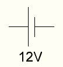     | Batterie         | Bat        |
| 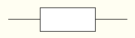 | Widerstand       | R          |
| 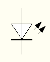               | LED              | D          |
| 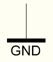               | GND (-)          |            |
| 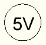                 | 5V (+)           |            |
| 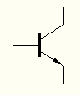    | NPN - Transistor | T          |
| 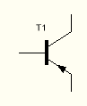    | PNP - Transistor | T          |

<div id='section-id-21'/>

### 2.3 Widerstandsberechnung

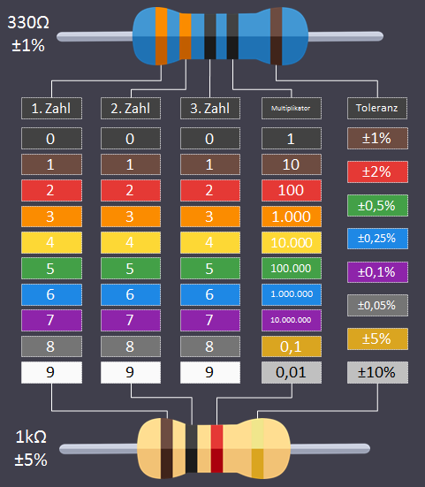

<div id='section-id-25'/>

#### 2.3.1 5 - Ringe

Widerstand = (1. Ring 2.Ring 3. Ring) \* 4.Ring<br />
Toleranz = 5. Ring

<div id='section-id-30'/>

##### Beispiele

1. rot-rot-schwarz-schwarz-braun<br />
   <br />
   2 2 0 x 1 = 220Ω

2. braun-schwarz-schwarz-gelb-braun<br />
   <br />
   1 0 0 x 10.000 = 1.000.000Ω = 1MΩ

<div id='section-id-40'/>

#### 2.3.2 4 - Ringe

Widerstand = (1. Ring 2.Ring) \* 3.Ring<br />
Toleranz = 4. Ring

<div id='section-id-45'/>

##### Beispiele

1. orange-orange-braun-braun<br />
   <br />
   3 3 x 10 = 330Ω

2. braun-schwarz-blau-braun<br />
   <br />
   1 0 x 1.000.000 = 10.000.000Ω = 10MΩ

<div id='section-id-55'/>

## 3. Die Arduino IDE

<div id='section-id-57'/>

### 3.1 Die Grundeinstellungen

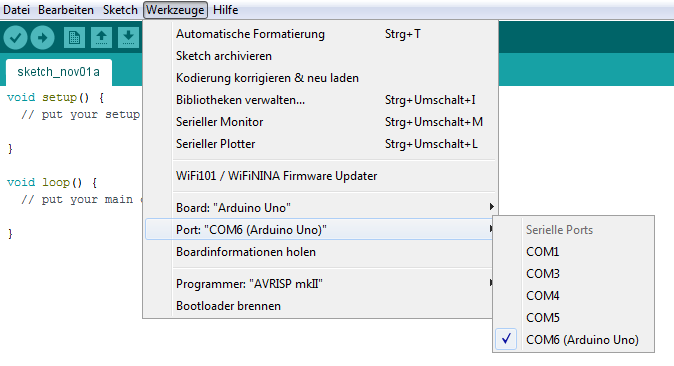

<div id='section-id-61'/>

### 3.2 Die kleine Zahl links unten

<div id='section-id-63'/>

##### Aufgabe

Finde heraus, für was die kleine Zahl in der linken unteren Ecke steht.

<div id='section-id-67'/>

##### Lösung

Die Zahl links unten in der Ecke gibt die Zeilennummer, in der sich der Cursor aktuell befindet, an.
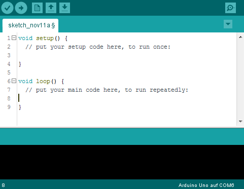

<div id='section-id-72'/>

## 4. Das erste Blinken

<div id='section-id-74'/>

### 4.1 Einfaches Blinklicht

Das [Programm](./programme/4.1_Blinklicht/Blinklicht.ino) lässt die LED im Einsekundentakt blinken.

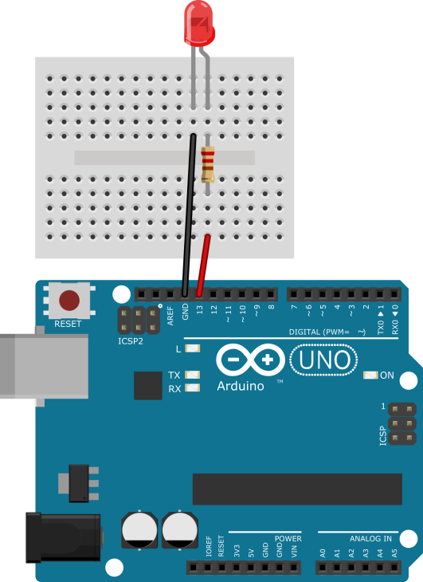

<div id='section-id-80'/>

### 4.2 Schnelles Blinken

Die Frequenz in der die LED maximal blinken darf, kann man entweder durch Ausprobieren ([Sketch](./programme/4.2_SchnellesBlinken/Blinklicht/Blinklicht.ino) immer wieder hochladen) herausfinden, oder durch ein [Programm](./programme/4.2_SchnellesBlinken/FrequenzMesser/FrequenzMesser.ino), dass die Helligkeit auf dem seriellen Monitor ausgibt und sich mit zwei Tastern einstellen lässt.

<div id='section-id-84'/>

##### Lösung

Ich kann das Blinken ab einer Frequenz von 30Hz nicht mehr erkennen.

<div id='section-id-88'/>

##### Schaltung für zweiten Versuchsaufbau

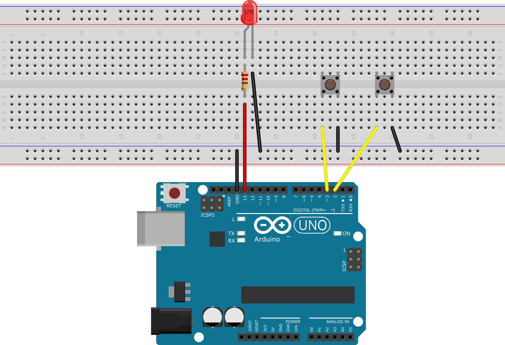

<div id='section-id-92'/>

### 4.3 Windradblinken

Das [Programm](./programme/4.3_Windradblinken/Windradblinken.ino) lässt die LED in folgendem Rhythmus blinken.

```diff
1. 1s an <----|
2. 0,5s aus   |
3. 1s an      |
4. 1,5s aus --|
```

<div id='section-id-103'/>

### 4.4 Rhythmus bestimmen

Die LED leuchtet beim Start 0,4s und ist dann abwechselnd 0,2s aus und 0,7s an.
Ablaufdiagramm:

```diff
1. Bei Start 0,4s an
2. 0,2s aus  <-----------|
3. 0,7s an  -------------|
```

<div id='section-id-114'/>

### 4.5 Programme zuordnen

Beim Ausführen des ersten Programmes wird die LED nur einmal blinken, da der komplette Code im Setup Block steht (der nur einmalig ausgeführt wird). Beim zweiten Programm wird die LED dauerhaft eingeschaltet sein, mit einer ganz kurzen Pause, in der sie aus ist, die das Programm braucht, um vom Ende der Loop Schleife wieder an den Anfang zu springen, da es da nur einen `delay` Befehl gibt.

<div id='section-id-118'/>

### 4.6 Ampel

Wie überall, gibt es hier auch wieder verschiedene Programme, die [Einfachen](./programme/4.6_Ampel/Ampel_beginner/Ampel_beginner.ino) und die [Fortgeschrittenen](./programme/4.6_Ampel/Ampel_expert/Ampel_expert.ino). Bei der zweiten Variante werden die LED Pins mit `defines` definiert, so dass man sie ganz einfach ändern kann, wenn man die LEDs an anderen Pins anschließt.

<div id='section-id-122'/>

### 4.7 Befehlesammlung

| Befehl           | Argumente                                        | Beschreibung                                                                                                            |
| ---------------- | ------------------------------------------------ | ----------------------------------------------------------------------------------------------------------------------- |
| `pinMode`        | `pin (1,2,3,..)` `mode (INPUT,OUTPUT)`           | Definiert den übergebenen pin als den übergebenen Modus.                                                                |
| `digitalWrite`   | `pin (1,2,3,..)` `zustand (HIGH,LOW)`            | Setzt den übergebenen Pin auf LOW oder HIGH                                                                             |
| `analogWrite`    | `pin (1,2,3,..A1, A2,..)` `value (0-255,0-1023)` | Schreibt einen analogen Wert bei analogen Pins von `0-1023` möglich und bei digitalen Pins mit PWM von `0-255` möglich. |
| `digitalRead`    | `pin (1,2,3,..)`                                 | Liest den digitalen Zustand eines Pins aus `LOW (0)` `HIGH (1)`                                                         |
| `analogRead`     | `pin (1,2,3,..,A1,A2,..)`                        | Liest den analogen Zustand eines Pins aus `0-255` bei digitalen oder bei analogen Pins `0-1023`                         |
| `delay`          | `zeit`                                           | Wartet die angegebene Zeit in Millisekunden                                                                             |
| `tone`           | `pin (1,2,3,..)` `Frequenz` `Zeit`               | Erzeugt eine Frequenz eines Tones am übergebenen Pin mit der übergebenen Frequenz für die optional übergebene Zeit      |
| `noTone`         | `pin (1,2,3,..)`                                 | Stoppt die Wiedergabe eines Tones am angegebenen Pin                                                                    |
| `Serial.begin`   | `Baudrate (9600,115200,..)`                      | Initialisiert die Verbindung des seriellen Monitors                                                                     |
| `Serial.print`   | `Text`                                           | Schreibt dem mit dem ersten Argument übergebenen Text auf den seriellen Monitor in eine Zeile                           |
| `Serial.println` | `Text`                                           | Wie `print`, schreibt jedoch am Ende einen Zeilenumbruch                                                                |
| `randomSeed`     | `Entropie`                                       | Initialisiert den Zufallsgenerator mit einem Random Seed als Entropie übergeben                                         |
| `random`         | `min` `max`                                      | Gibt eine Zufallszahl in dem definierten Bereich zurück                                                                 |
| `millis`         |                                                  | Gibt die Zeit seit Start des Mikrocontrollers in Millisekunden zurück                                                   |
| `micros`         |                                                  | Wie `millis`, jedoch in Mikro Sekunden                                                                                  |
| `while`          | `Bedingung`                                      | Führt den in `{}` angegebenen Code solange aus, bis die angegebene Bedingung nicht mehr zutrifft                        |

<div id='section-id-143'/>

## 5 Töne, Unterprogramme, Transistor

<div id='section-id-145'/>

### 5.1 Alle meine Entchen

Wie immer gibt es verschiedene Wege, alle meine Entchen zu implementieren. Eine [Anfängerversion](./programme/5.1_AlleMeineEntchen/AlleMeineEndchen_beginner/AlleMeineEntchen_beginner.ino), in der die Befehle für die Töne einfach nacheinander kommen und eine [Expertenversion](./programme/5.1_AlleMeineEntchen/AlleMeineEndchen_expert/AlleMeineEntchen_expert.ino), in der mithilfe einer Schleife durch ein array iteriert wird und der jeweilige Ton gespielt wird.

<div id='section-id-149'/>

##### Versuchsaufbau

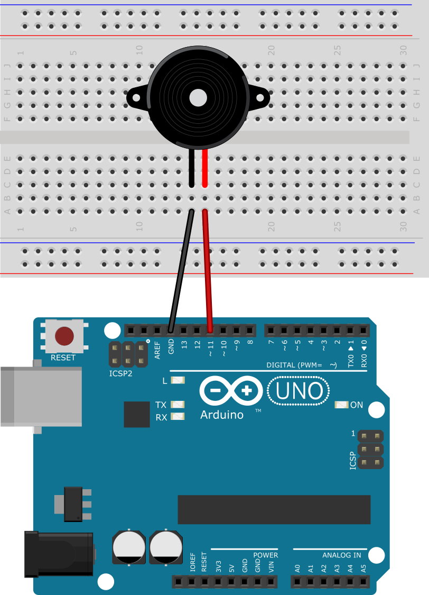

<div id='section-id-153'/>

### 5.2 Eigene Funktionen

Durch eigene Funktionen kann man sehr viele Zeilen an doppeltem Code sparen und gleichzeitig etwas an Struktur und Ordnung in das [Programm](./programme/5.2_EigeneFunktionen/EigeneFunktionen.ino) bringen.

<div id='section-id-157'/>

### 5.3 Transistor vor dem Lautsprecher

Will man nun doch etwas mehr Soundqualität, so muss man zu einem richtigen Lautsprecher greifen. Da durch einen großen Lautsprecher ein größerer Strom fließt, muss man ihn noch mit einem Transistor verstärken, wie in der nachfolgenden Schaltung aufgezeichnet. Der Widerstand mit 2,2kΩ in der folgenden Schaltung wird verwendet, um den Strom, der am Transistor anliegt zu begrenzen, so dass der Transistor nicht zu heiß wird.

<div id='section-id-161'/>

#### 5.3.1 Berechnung des Basiswiderstand (fortgeschritten)

1. Um den Widerstand zu berechnen berechnet man als erstes die Spannung, die am Widerstand abfallen muss.

<!-- $$
\LARGE U_{R}=5V-0,8V=4,2V
$$ --> 

<div align="center"></div>

2. Dann berechnet man die Stromstärke, die durch den Lautsprecher und den Transistor fließt.

<!-- $$
\LARGE I=\frac{U}{R}=\frac{5V}{32\Omega}=0,15625A
$$ --> 

<div align="center"></div>

3. Ein handelsüblicher NPN - Transistor hat einen Verstärkungsfaktor von ungefähr (B = 100).

<!-- $$
\LARGE I_{R}=\frac{0,15625A}{100}=0,001525A
$$ --> 

<div align="center"></div>

4. Als letztes müssen wir nun den richtigen Widerstand aus den zuvor berechneten Werten berechnen.

<!-- $$
\LARGE R_{1}=\frac{U_{R}}{I_{R}}=\frac{4,2V}{0,001525A}=2754\Omega
$$ --> 

<div align="center"></div> 

5. Der nächstkleinere Wiedertand aus der E12 Reihe wäre 2,7kΩ aber wir nehmen den nächstkleineren 2,2kΩ Widerstand, so dass die Basis richtig durchgesteuert wird.

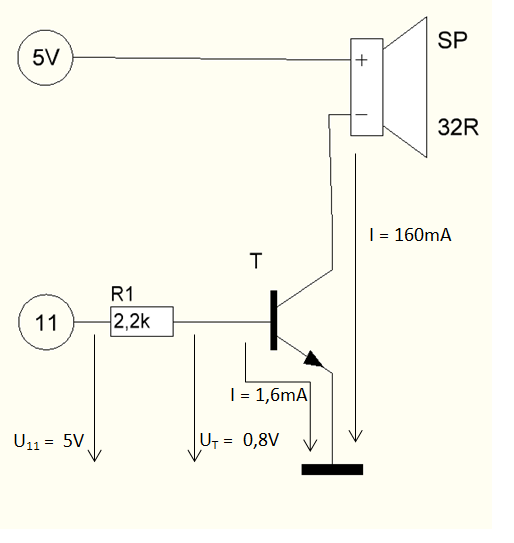
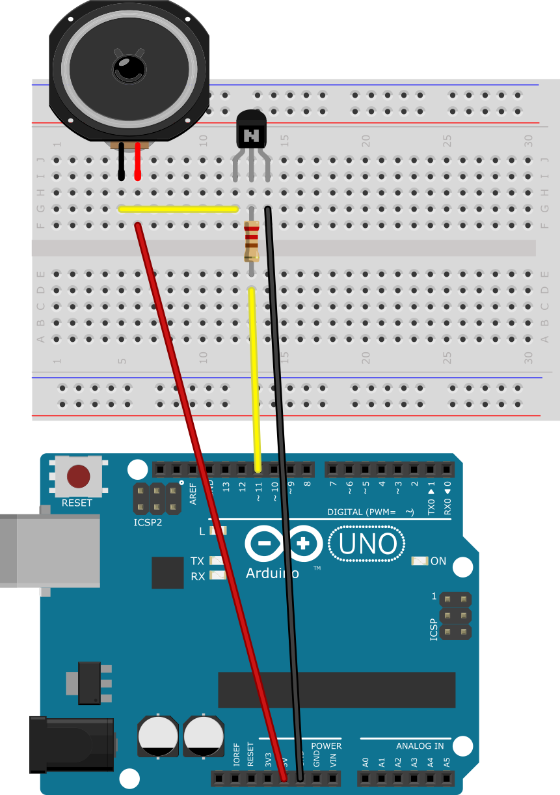

<div id='section-id-192'/>

## 6. Variablen

<div id='section-id-194'/>

### 6.1 Variablenwerte bestimmen

Folgende Werte stehen in den Variablen des Programmes nach dem Ausführen des Programmes.

```diff
a = 220
n = 32
m = 220
```

<div id='section-id-204'/>

### 6.2 Variablen für die Tondauer

In diesem [Programm](./programme/6.2_VariablenFuerTondauer/VariablenFuerTondauer.ino) sind drei Variablen für die Tonlängen angelegt.

<div id='section-id-208'/>

### 6.3 Was tut das Programm?

Das [Programm](./programme/6.3_WasTutDasProgramm/WasTutDasProgramm.ino) wird einen Ton abspielen, der bei 100Hz anfängt und alle 100ms 1Hz höher wird.

<div id='section-id-212'/>

## 7 Texte und Werte anzeigen

<div id='section-id-214'/>

### 7.1 Was zeigt das Programm an?

Das Programm wird folgendes in der seriellen Konsole anzeigen:

```diff
Dieses kurze Gedicht
endet
nicht
nicht
nicht
nicht
...
```

<div id='section-id-228'/>

### 7.2 Gesichter in der Konsole

Dieses [Programm](./programme/7.2_Gesichter/Gesichter.ino) schreibt ein lachendes und ein trauriges Gesicht in die Konsole.

<div id='section-id-232'/>

### 7.3 Variablenüberlauf

Wenn man ein [Programm](./programme/7.3_Variablenueberlauf/Variablenueberlauf.ino) ausführt, dass eine Variable unbegrenzt erhöht ausführt, kann man etwas seltsames beobachten:

```tex
32762
32763
32764
32765
32766
32767
-32768
-32767
-32766
-32765
```

Man sieht, dass der Arduino nur bis 32767 zählt und dann wieder von vorne also -32765 anfängt. Das liegt daran, dass ein Integer nur 16bit (2byte) zum speichern bekommt. Deswegen kann er keine größeren Zahlen als von -2^15 bis (2^15) – 1 speichern. Das Verhalten kann man dadurch begründen, dass der Arduino die Zahlen binär addiert und nach `111111111111111` wieder von vorne also `000000000000000` anfängt. Der Arduino nutzt dafür eine Technik, namens Zweierkomplement um die Zahl zu speichern. Diese Art zu rechnen nennt sich auch Modulorechnen.

<div id='section-id-251'/>

## 8 for - Schleife

<div id='section-id-253'/>

### 8.1 Was machen die Parameter der for Schleife?

Das Programm wird 30mal `Hallo` und in die nächste Zeile den aktuellen Wert von `n` schreiben, der die Anzahl an bereits passierten Durchläufen angibt. Wenn man im ersten Parameter der for – Schleife `n = 5` angibt, fängt die Schleife bei `5` statt bei `0` an. Wenn man im zweiten Parameter `n < 50` verwendet wird die Schleife mit einem ersten Parameter von `n = 0` statt nur 30mal 50mal durchlaufen. Und wenn man als dritten Parameter `n = n +3` angibt, wird das Programm die Variable `n` in Dreierschritten während des Durchlaufs hochzählen.

<div id='section-id-257'/>

### 8.2 Was tut diese Schleife?

Dieses Programm wird einen Ton abspielen, der bei 100Hz anfängt, und sich in 3er Schritten alle 60ms bis zu 1000Hz erhöht.

<div id='section-id-261'/>

### 8.3 Yelp – Sirene

Um eine Yelp – Sirene, wie in diesem [Video](https://www.youtube.com/watch?v=m84m1A62KxQ) zu implementieren braucht man zwei for - Schleifen, die den Ton abwechselnd höher und tiefer werden lassen [Beispielimplementierung](./programme/8.3_YelpSirene/YelpSirene.ino).

<div id='section-id-265'/>

### 8.4 Lauflicht

Dieses [Programm](./programme/8.4_Lauflicht/Lauflicht.ino) nutzt eine for - Schleife, um im Setup Teil alle Pins zu initialisieren und eine, um im Loop Teil die LEDs abwechselnd blinken zu lassen. Diesen Versuchsaufbau kann man dafür verwenden.
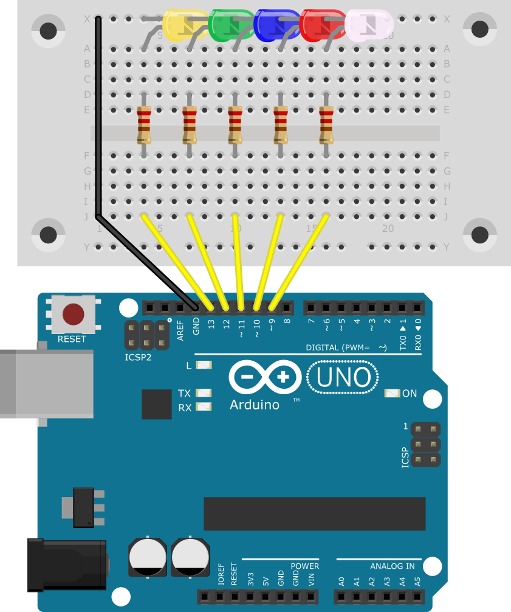

<div id='section-id-270'/>

## 9 LEDs Dimmen und Farben

<div id='section-id-272'/>

### 9.1 LED Dimmen

Um eine LED zu dimmen muss man statt `digitalWrite`, `analogWrite` nehmen. Dieses [Programm](./programme/9.1_Dimmen/Dimmen.ino) dimmt die LED.

<div id='section-id-276'/>

### 9.2 Dunkel Heller Programm

Dieses [Programm](./programme/9.2_DunklerHeller/DunklerHeller.ino) lässt die LED langsam dunkler -> heller werden.

<div id='section-id-280'/>

### 9.3 Halbe Helligkeit

Wenn man herausfinden will, welcher Wert die halbe Helligkeit ist, braucht man erst einmal einen Referenzwert. Dies kann man mit einer zweiten LED in derselben Farbe, die auf 100% Helligkeit ist, lösen. Um nun die halbe Helligkeit herauszufinden, kann man wie immer [alle Werte austesten](./programme/9.3_HelligkeitHerausfinden/HerausfindenDurchAusprobieren/HerausfindenDurchAusprobieren.ino), oder das Ganze mit einem verstellbaren Widerstand machen (siehe [zweite Version](./programme/9.3_HelligkeitHerausfinden/HerausfindenDurchPoti/HerausfindenDurchPoti.ino)).

Ich empfinde einen Wert zwischen 75 und 85 als halbe Helligkeit.

<div id='section-id-286'/>

##### Schaltung mit Poti

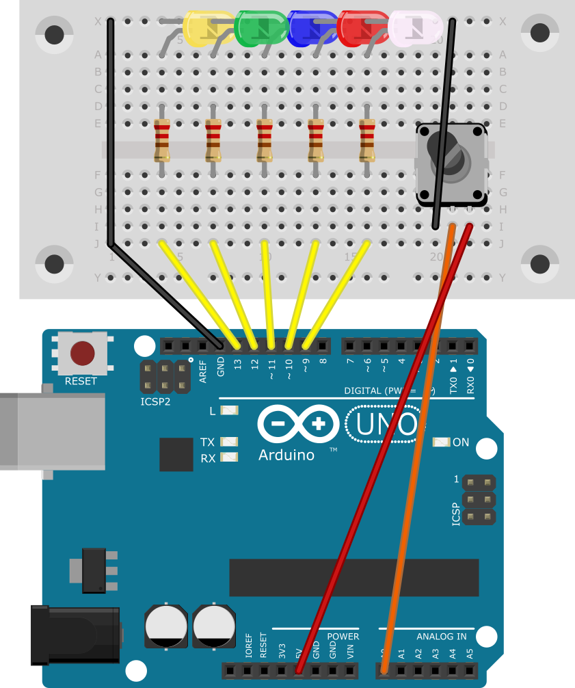

<div id='section-id-290'/>

### 9.4 Flackernde Kerze

Dieses [Programm](./programme/9.4_FlackerndeKerze/FlackerKerze/FlackerKerze.ino) lässt die LED flackern, indem es die LED in zufälligen Abständen zufällig hell/dunkel einschaltet.

<div id='section-id-294'/>

### RGB LED

<div id='section-id-296'/>

##### Mischfarben

```diff
Rot + grün -> Gelb
Rot + Blau -> Violett
Grün + Blau -> Cyan
```

<div id='section-id-304'/>

##### LED Aufbau


<div id='section-id-308'/>

### 9.6 Fehlersuche

```cpp
void setup(); {
    serialBegin(6900);
}

void loop {
    for(int i=0;i<10;i=i+1) {
        Serial.pint("Huhu");
        for(u=0,u<100;u=u+1) {
            Serial.print(i);
            Serial.print(",");
            Serial.print(u);
        }
    }

```

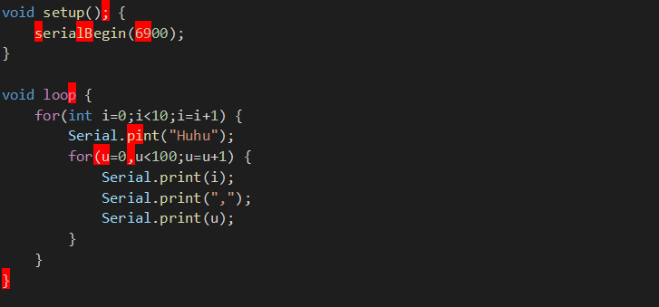

[Korrigierte Version](./programme/9.6_FehlerImProgramm/FehlerImProgramm.ino)

Ich habe 9 syntaktische Fehler gefunden.

<div id='section-id-333'/>

### 9.7 Alle möglichen Farben einer RGB LED

Das folgende [Programm](./programme/9.7_AlleMoeglichenFarben/AlleMoeglichenFarben/AlleMoeglichenFarben.ino) geht alle 16.777.216 (256^3) Farben durch. Das wird sehr komisch aussehen, erfüllt aber die Aufgabe, da es als Erstes den Rot-Wert auf 1 setzt, dann den Grün-Wert auch auf 1 und dann alle 255 Blau-Werte durch geht. Dann wird es den Rot-Wert auf 2 erhöhen und wieder alle Blau-Werte durchgehen. Ein solcher Durchlauf dauert dann `(255^3)ms`. Wenn man aber alle Farben nacheinander gemischt durchgehen möchte, kann man folgenden [Sketch](./programme/9.7_AlleMoeglichenFarben/AmbientLight/AmbientLight.ino) verwenden.

<div id='section-id-337'/>

## 10 If heißt falls

<div id='section-id-339'/>

### 10.1 Schere Stein Papier

Um beim Start Schere, Stein oder Papier ausgeben zu lassen, kann man das mit 3 if-Abfragen, wie in diesem [Programm](./programme/10.1_SchereSteinPapier/SchereSteinPapier.ino) machen.

<div id='section-id-343'/>

### 10.2 Was tut das Programm?

Das angegebene Programm wird die LED an Pin 9 mit einer Helligkeit von `100` anschalten, bis die Loop Schleife so oft durchgelaufen ist, dass die Variable `i` größer oder gleich `100000` ist. Dann wird sie dauerhaft mit voller Helligkeit leuchten.

<div id='section-id-347'/>

## 11 Eingabe mit Tastern

<div id='section-id-349'/>

### 11.1 Was steht in der Konsole?

Ja, diese Aussage ist richtig, dass bei gedrücktem Taster eine `0` in der Konsole steht, da der Pin dann mit GND durch den Taster verbunden ist. [Programm](./programme/11.1_Taster/Taster.ino)

<div id='section-id-353'/>

### 11.2 LED mit Taster steuern

Diese Aufgabe kann man wie verlangt mit einer [if-else](./programme/11.2_TasterLED/TasterLED_beginner/TasterLED_beginner.ino) lösen, geht aber noch deutlich einfacher, wenn man sich Verneinung wie in diesem [Programm](./programme/11.2_TasterLED/TasterLED_expert/TasterLED_expert.ino) ansieht.

<div id='section-id-357'/>

### 11.3 Töne per Knopfdruck erzeugen

Wenn man einen tiefen und einen hohen Ton erzeugen will, kann man dieses [Programm](./programme/11.3_ZweiTasterLautsprecher/ZweiTasterLautsprecher.ino) nutzen. Dabei wird beim Drücken des ersten Tasters ein Ton von 440Hz abgespielt und beim Drücken des zweiten ein Ton von 740Hz. Und wenn gar keiner gedrückt ist, wird auch kein Ton gespielt.

<div id='section-id-361'/>

### 11.4 Taster Zähler

Wenn man ein [Programm](./programme/11.4_TasterZaeler/TasterZaeler_beginner/TasterZaeler_beginner.ino) schreibt, das einfach nur eine Variable hochzählt, wenn der Taster gedrückt wird, kann man beobachten, dass die Zahl mehrfach pro Druck hochgezählt wird. Dies kann man, wie wir später noch kennen lernen werden, mit einer [while Schleife](./programme/11.4_TasterZaeler/TasterZaeler_expert/TasterZaeler_expert.ino) verhindern.

<div id='section-id-365'/>

### 11.5 Millis

Ja, mit diesem [Programm](./programme/11.5_Millis/Millis.ino) kann man herausfinden, dass es durchschnittlich etwa 4ms braucht, um ein Zeichen auf die Konsole zu schreiben.

<div id='section-id-369'/>

## 12 Wiederholungen mit while

<div id='section-id-371'/>

### 12.1 Wie läuft das Programm ab?

Das beschriebene Programm wird nie bis in die loop-Schleife kommen, da es in der while-Schleife mit einer Bedingung, die immer wahr ist, hängen bleibt. Es wird als erstes die Zahlen von 1-99 ausgeben und dann unendlich viele `!`.

<div id='section-id-375'/>

### 12.2 Was tut die leere while – Schleife?

Die leere Schleife wartet, bis die Taste an Pin 4 gedrückt wird, gibt dann `von jetzt` aus, wartet, bis der Taster losgelassen wird und gibt dann `bis jetzt` in derselben Zeile aus.

<div id='section-id-379'/>

### 12.3 Ton mit Taster

Dieses [Programm](./programme/12.3_TonMitTaster/TonMitTaster.ino) kann einen Ton erzeugen, und man kann mithilfe den 2 Tastern die Frequenz des Tones regeln. Dabei werden 2 while - Schleifen verwendet, um im Programm so lange zu warten, bis der Taster losgelassen wurde.

<div id='section-id-383'/>

## 13 Programme planen

<div id='section-id-385'/>

### 13.1 Programmablaufplan lesen

Dieses [Programm](./programme/13.1_Programmablaufplan/PAPlesen.ino) schreibt, wie auf dem PAP beschreiben, die Zahlen 10 bis 100 in 2er - Schritten auf den seriellen Monitor.

<div id='section-id-389'/>

### 13.2 Programmablaufplan schreiben

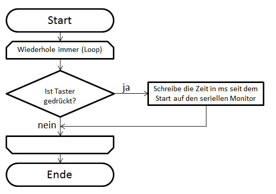

<div id='section-id-393'/>

### 13.3 PAPs skizzieren

<div id='section-id-395'/>

##### Aufgabe 9.7

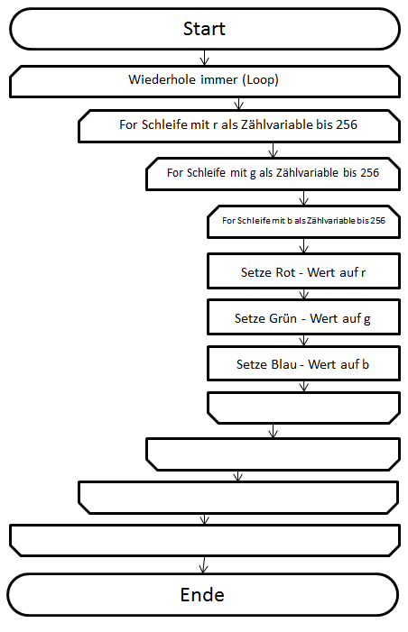

<div id='section-id-399'/>

##### Aufgabe 12.2

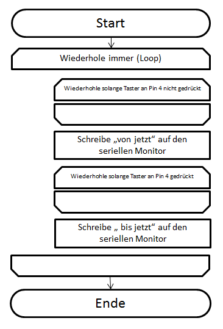

<div id='section-id-403'/>

## 14 LCD Display

<div id='section-id-405'/>

### 14.1 Bibliothek installieren

Um ein LCD - Display anzusteuern müsste man viel zu viele Befehle nutzen. Deswegen hat sich jemand anders die Mühe gemacht und mehrere Funktionen dafür geschrieben. Diese Funktionen zusammen kann man in einem Paket einer sogenannten Bibliothek herunterladen. Um diese Bibliothek herunterzuladen geht man auf `Sketch –> Bibliothek einbinden –> Bibliotheken verwalten` oder alternativ drückt man `Strg + Umschalt + I`. Dann sucht man nach dem Namen `LiquidCrystal I2C` und drückt auf installieren. Hat man das geschafft, kann man weiter machen.

<div id='section-id-409'/>

### 14.2 Kontrast einstellen

Mithilfe des Potis auf der Rückseite lässt sich der Kontrast des Displays regulieren.

<div id='section-id-413'/>

### 14.3 Was macht das Programm

In meinem Fall ist die I2C Adresse nicht `0x27` sondern `0x3f`. Dieses [Programm](./programme/14.3_LCDDisplay/LCDDisplay.ino) zeigt auf dem LCD-Display `Zeit: <Die vergangene Zeit in Millisekunden seit dem Start des Arduino>` an. Mit den Befehlen `Lcd.backlight();` und `Lcd.noBacklight();` kann man die Hintergrundbeleuchtung ein/-ausschalten.

<div id='section-id-417'/>

## 15 Motor steuern

Da wir keine solche Motorsteuerplatine zur Steuerung haben, verwenden wir den L293D Chip direkt und bauen die folgende Schaltung selber auf. Um einen Motor anzusteuern ist es empfehlenswert, ein externes Netzteil zu verwenden, um die USB-Buchse des PCs nicht zu stark zu belasten.

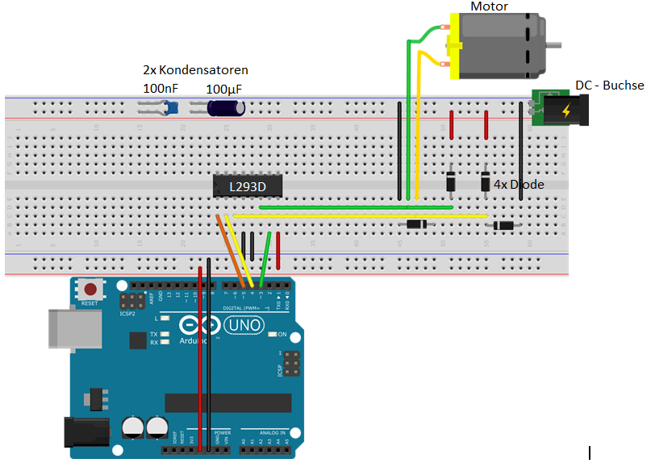

<div id='section-id-423'/>

### 15.1 Ersten Motor steuern

Dieses [Programm](./programme/15.1_MotorSteuern/MotorSteuern.ino) lässt den Motor für 2 Sekunden laufen, schaltet ihn wieder 2 Sekunden aus, 2 Sekunden an, ... Dabei schaltet man zuerst den Motor frei `digitalWrite(ENABLE, HIGH);`, setzt Richtung 2 auf `LOW` und Richtung 1 immer wieder ein und aus.

<div id='section-id-427'/>

### 15.2 Motor in verschiedene Richtungen drehen

Will man den Motor nun in zwei verschiedene Richtungen drehen, muss man beachten, dass man den Motor beschädigen kann, falls man versucht beide Richtungen auf `HIGH` zu setzen. In diesen [Programm](./programme/15.2_UnterprogrammeFuerMotor/MotorSteuernUnterprogramme.ino) gibt es für alle Richtungen (Vorwärts, Rückwärts und Stopp) ein Unterprogramm.
