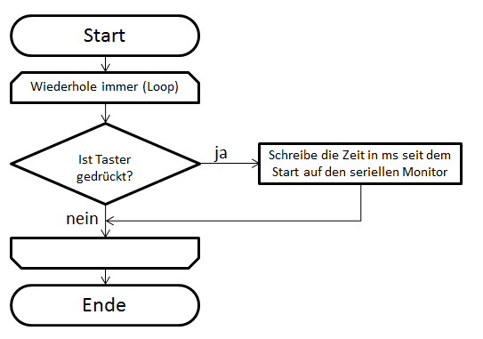
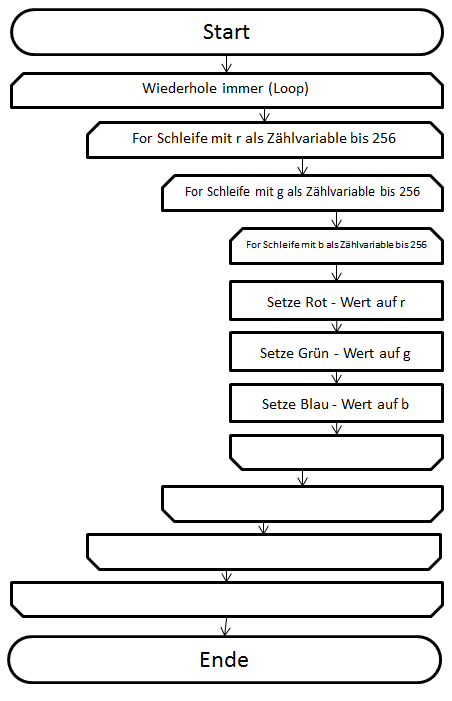
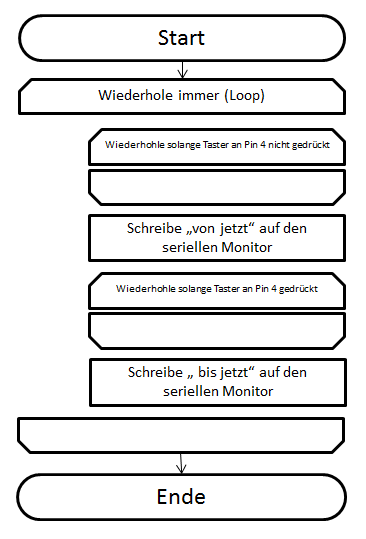

# 13. Programme planen

## 13.1 Programmablaufplan lesen

Dieses Programm schreibt, wie auf dem PAP zu sehen, die Zahlen 10 bis 100 in 2er - Schritten auf den seriellen Monitor.

[PAPlesen.ino]({GITHUB}/programme/ArduinoEinfuehrung/13.1_Programmablaufplan/PAPlesen.ino ':include :type=code arduino :link :wrap :open')

## 13.2 Programmablaufplan schreiben

## 13.3 PAPs skizzieren

### Aufgabe 9.7

### Aufgabe 12.2

