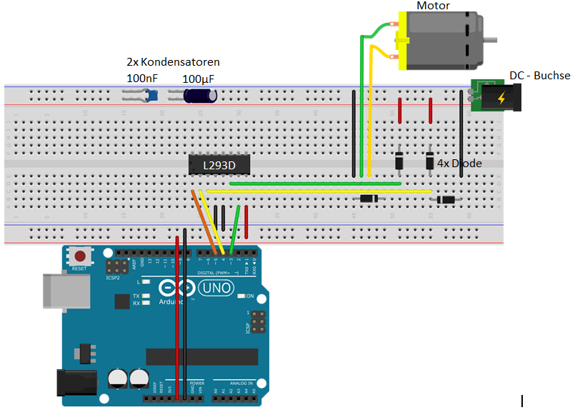
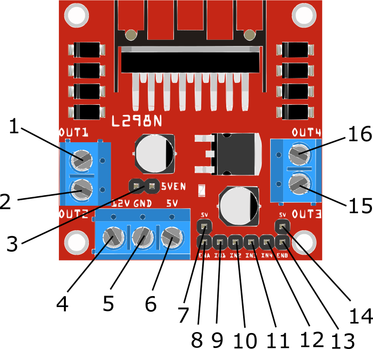
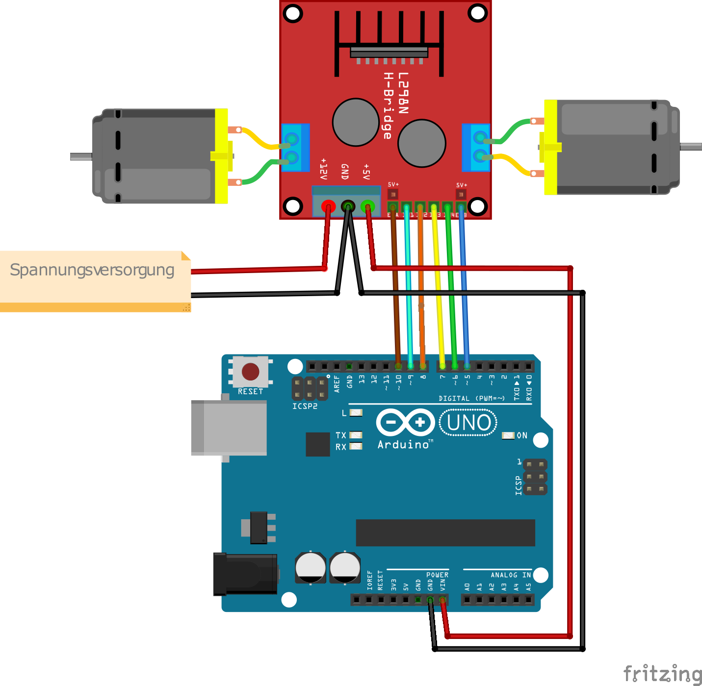

# 15. Motor steuern

Um einen Motor mithilfe des Arduinos zu steuern benötigt man einen Motortreiber und ein Netzteil/Batterie, um die
USB-Buchse des PCs nicht zu stark zu belasten. So eine Motorsteuerungseinheit lässt sich entweder selbst auf einem
Steckboard bauen, aber auch schon fertig Kaufen.

## 15.1 Ersten Motor steuern

Dieses Programm lässt den Motor für 2 Sekunden laufen, schaltet ihn wieder 2 Sekunden aus, 2 Sekunden an, ... Dabei
schaltet man zuerst den Motor frei `digitalWrite(ENABLE, HIGH);`, setzt Richtung 2 auf `LOW` und Richtung 1 immer wieder
ein und aus.

[MotorSteuern.ino]({GITHUB}/programme/ArduinoEinfuehrung/15.1_MotorSteuern/MotorSteuern.ino ':include :type=code arduino :link :wrap :open')

## 15.2 Motor in verschiedene Richtungen drehen

Will man den Motor nun in zwei verschiedene Richtungen drehen, muss man beachten, dass man den Motor beschädigen kann,
falls man versucht beide Richtungen auf `HIGH` zu setzen. In diesen Programm gibt es für alle Richtungen (Vorwärts,
Rückwärts und Stopp) ein Unterprogramm.

[MotorSteuernUnterprogramme.ino]({GITHUB}/programme/ArduinoEinfuehrung/15.2_UnterprogrammeFuerMotor/MotorSteuernUnterprogramme.ino ':include :type=code arduino :link :wrap :open')

## 15.3 Motorsteuerplatine

Wie oben schon beschrieben, gibt es auch fertige Steuerungen, die man nur noch anschließen muss. Hier werde ich nun den
L298N Motortreiber verwenden. Dieser kann zum Beispiel bei
[Reichelt](https://www.reichelt.de/de/de/entwicklerboards-motodriver2-l298n-debo-motodriver2-p202829.html) bestellt
werden.

### 15.3.1 Aufbau

1. Output 1 für Motor 1
2. Output 2 für Motor 1
3. 12V Jumper, aktiviert die 5V regelung, wenn mehr als 12V anliegen
4. Eingang (max. 35V)
5. Eingang GND
6. 5V (z.b. für Arduino, wenn man merh als 12V Versorgungsspannung hat)
7. 5V für Jumper auf pin 8 wenn man die volle Geschwindigkeit an Motor 1 möchte
8. Enable 1 (Motor 1)
9. Input 1 (Motor 1)
10. Input 2 (Motor 1)
11. Input 3 (Motor 2)
12. Input 4 (Motor 2)
13. Enable 2 (Motor 2)
14. 5V für Jumper auf pin 13 wenn man die volle Geschwindigkeit an Motor 2 möchte
15. Output 3(1) für Motor 2
16. Output 4(2) für Motor 2

[MotorsteuerPlatine.ino]({GITHUB}/programme/ArduinoEinfuehrung/15.3_MotorsteuerPlatine/MotorsteuerPlatine.ino ':include :type=code arduino :link :wrap :open')

Diese Programm definiert als erstes alle PINS, die mit dem Motortreiber verbunden sind. Für jeden Motor gibt es nun 3
Pins:

- enable (`M_1`/`M_2`) --> bestimmt, ob der Motor dreht und wie schnell
- input 1 (`IN_1`/`IN_3`) --> Richtung 1
- input 2 (`IN_2`/`IN_4`) --> Richtung 2

Hierbei muss man beachten, dass man die Input pins für die Richtung nicht geleichzeitig auf HIGH setzt, da sonst der
Motor beschädigt werden kann. Als nächstes werden im setup Bereich des Programms ersteinmal alle Pins als `OUTPUT`
definiert. Im loop Bereich wird nun Richtung 1 für Motor 1 und 2 eingestellt. Dies passiert, wenn man den ersten Input
auf `HIGH` und den zweiten Input auf `LOW` setzt. Die Geschwindigkeit wird dabei beide mal auf `200`/`255` mithilfe von
`analogWrite` eingestellt. Danach wird nun 2s gewartet und die Richtung beider Motoren umgedreht. Hier ist nun auch
wichtig, dass man als erstes die Richtung, die gerade `HIGH` ist auf `LOW` setzt, da sonst für einen kurzen Moment beide
Richtungen auf `HIGH` sind. Als nächstes wird erneut mit der nun anderen Richtung 2s gewartet. Und als letztes nochmal
alle zwei Motoren für 2s ausgeschaltet.
