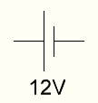
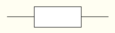
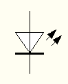
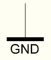
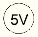
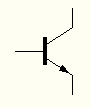
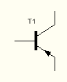
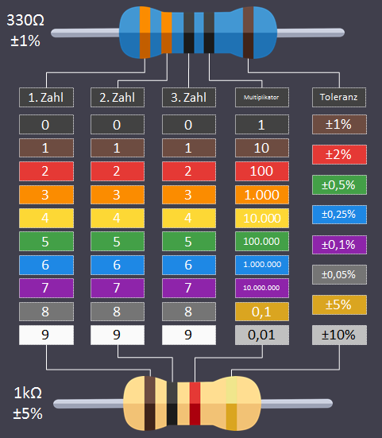

# 2. Es leuchtet

## 2.2 Schaltsymbole

| Schaltsymbol                                                              | Name             | Bezeichner |
| ------------------------------------------------------------------------- | ---------------- | ---------- |
|      | Batterie         | Bat        |
|  | Widerstand       | R          |
|                | LED              | D          |
|                | GND (-)          |            |
|                  | 5V (+)           |            |
|     | NPN - Transistor | T          |
|     | PNP - Transistor | T          |

## 2.3 Widerstandsberechnung

### 2.3.1 5 - Ringe

$Widerstand = \left ( 1.Ring\ 2.Ring\ 3.Ring \right ) \cdot 4.Ring$

$Toleranz = 5.Ring$

#### Beispiele

1. rot-rot-schwarz-schwarz-braun

   

   $2\ 2\ 2\ \cdot 1 = 220\Omega$

2. braun-schwarz-schwarz-gelb-braun

   

   $1\ 0\ 0\ \cdot 10.000 = 1.000.000\Omega = 1M\Omega$

### 2.3.2 4 - Ringe

$Widerstand = \left ( 1.Ring\ 2.Ring \right ) \cdot 3.Ring$

$Toleranz = 4.Ring$

#### Beispiele

1. orange-orange-braun-braun

   

   $3\ 3\ \cdot 10 = 330\Omega$

2. braun-schwarz-blau-braun

   

   $1\ 0\ \cdot 1.000.000 = 10.000.000\Omega = 10M\Omega$
