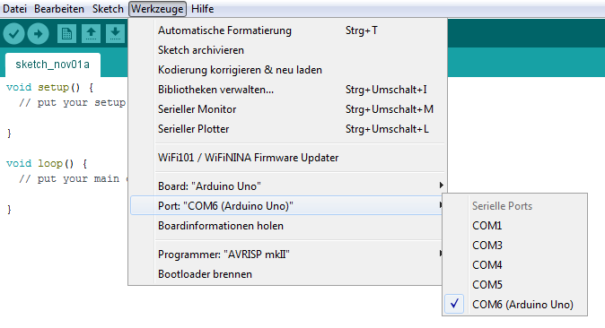
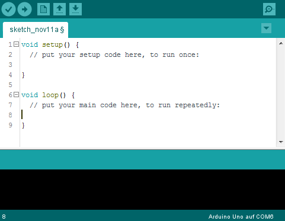

# 3. Die Arduino IDE

## 3.1 Die Grundeinstellungen

## 3.2 Die kleine Zahl links unten

### Aufgabe

Finde heraus, für was die kleine Zahl in der linken unteren Ecke steht.

### Lösung

Die Zahl links unten in der Ecke gibt die Zeilennummer, in der sich der Cursor aktuell befindet, an.

