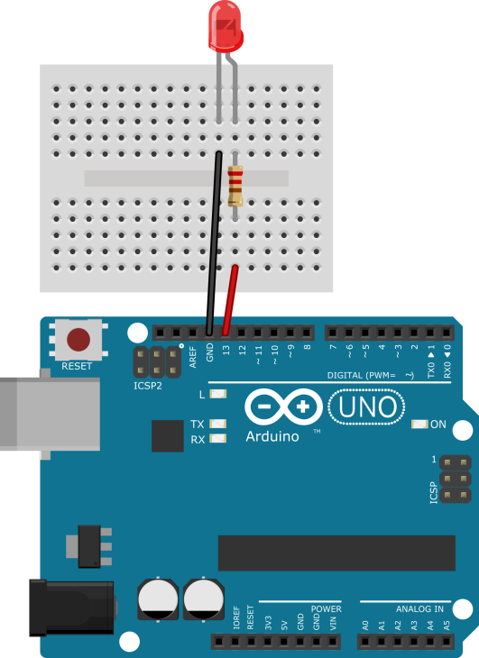
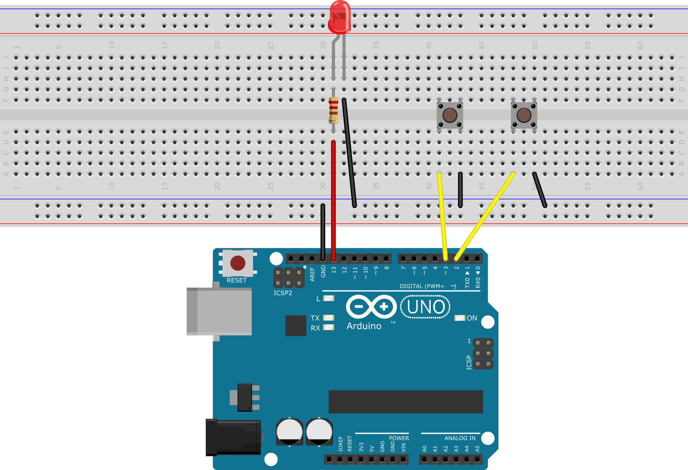
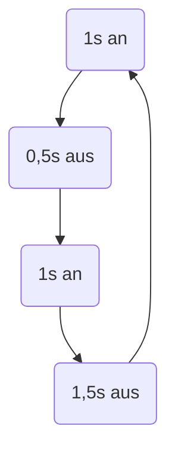
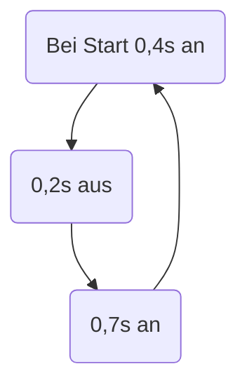

# 4. Das erste Blinken

## 4.1 Einfaches Blinklicht

Das Programm lässt die LED im Einsekundentakt blinken.

[Blinklicht.ino]({GITHUB}/programme/ArduinoEinfuehrung/4.1_Blinklicht/Blinklicht.ino ':include :type=code arduino :link :wrap :open')

## 4.2 Schnelles Blinken

Die Frequenz in der die LED maximal blinken darf, kann man entweder durch Ausprobieren und immer wieder erneutes
hochladen herausfinden.

<!-- markdownlint-disable-next-line line-length -->

[Blinklicht.ino]({GITHUB}/programme/ArduinoEinfuehrung/4.2_SchnellesBlinken/Blinklicht/Blinklicht.ino ':include :type=code arduino :link :wrap')

Eine weitere Lösung wäre die Frequenz mithilfe von zwei Tastern und einem counter, der auf dem seriellen Monitor
ausgegeben wird zu bestimmen.

<!-- markdownlint-disable-next-line line-length -->

[FrequenzMesser.ino]({GITHUB}/programme/ArduinoEinfuehrung/4.2_SchnellesBlinken/FrequenzMesser/FrequenzMesser.ino ':include :type=code arduino :link :wrap')

### Lösung

Ich kann das Blinken ab einer Frequenz von 30Hz nicht mehr erkennen.

### Schaltung für zweiten Versuchsaufbau

## 4.3 Windradblinken

Dieses Programm lässt die LED in folgendem Rhythmus blinken.

[Windradblinken.ino]({GITHUB}/programme/ArduinoEinfuehrung/4.3_Windradblinken/Windradblinken.ino ':include :type=code arduino :link :wrap :open')

## 4.4 Rhythmus bestimmen

Die LED leuchtet beim Start 0,4s und ist dann abwechselnd 0,2s aus und 0,7s an. Ablaufdiagramm:

## 4.5 Programme zuordnen

Beim Ausführen des ersten Programmes wird die LED nur einmal blinken, da der komplette Code im Setup Block steht (der
nur einmalig ausgeführt wird). Beim zweiten Programm wird die LED dauerhaft eingeschaltet sein, mit einer ganz kurzen
Pause, in der sie aus ist, die das Programm braucht, um vom Ende der Loop Schleife wieder an den Anfang zu springen, da
es da nur einen `delay` Befehl gibt.

## 4.6 Ampel

Wie überall, gibt es hier auch wieder verschiedene Programme, die Einfache Version

<!-- markdownlint-disable-next-line line-length -->

[Ampel_beginner.ino]({GITHUB}/programme/ArduinoEinfuehrung/4.6_Ampel/Ampel_beginner/Ampel_beginner.ino ':include :type=code arduino :link :wrap :open')

und die fortgeschrittene version. Bei dieer Variante werden die LED Pins mit `defines` definiert, so dass man sie ganz
einfach ändern kann, wenn man die LEDs an anderen Pins anschließt.

<!-- markdownlint-disable-next-line line-length -->

[Ampel_expert.ino]({GITHUB}/programme/ArduinoEinfuehrung/4.6_Ampel/Ampel_expert/Ampel_expert.ino ':include :type=code arduino :link :wrap')

## 4.7 Befehlesammlung

| Befehl           | Argumente                                        | Beschreibung                                                                                                            |
| ---------------- | ------------------------------------------------ | ----------------------------------------------------------------------------------------------------------------------- |
| `pinMode`        | `pin (1,2,3,..)` `mode (INPUT,OUTPUT)`           | Definiert den übergebenen pin als den übergebenen Modus.                                                                |
| `digitalWrite`   | `pin (1,2,3,..)` `zustand (HIGH,LOW)`            | Setzt den übergebenen Pin auf LOW oder HIGH                                                                             |
| `analogWrite`    | `pin (1,2,3,..A1, A2,..)` `value (0-255,0-1023)` | Schreibt einen analogen Wert bei analogen Pins von `0-1023` möglich und bei digitalen Pins mit PWM von `0-255` möglich. |
| `digitalRead`    | `pin (1,2,3,..)`                                 | Liest den digitalen Zustand eines Pins aus `LOW (0)` `HIGH (1)`                                                         |
| `analogRead`     | `pin (1,2,3,..,A1,A2,..)`                        | Liest den analogen Zustand eines Pins aus `0-255` bei digitalen oder bei analogen Pins `0-1023`                         |
| `delay`          | `zeit`                                           | Wartet die angegebene Zeit in Millisekunden                                                                             |
| `tone`           | `pin (1,2,3,..)` `Frequenz` `Zeit`               | Erzeugt eine Frequenz eines Tones am übergebenen Pin mit der übergebenen Frequenz für die optional übergebene Zeit      |
| `noTone`         | `pin (1,2,3,..)`                                 | Stoppt die Wiedergabe eines Tones am angegebenen Pin                                                                    |
| `Serial.begin`   | `Baudrate (9600,115200,..)`                      | Initialisiert die Verbindung des seriellen Monitors                                                                     |
| `Serial.print`   | `Text`                                           | Schreibt dem mit dem ersten Argument übergebenen Text auf den seriellen Monitor in eine Zeile                           |
| `Serial.println` | `Text`                                           | Wie `print`, schreibt jedoch am Ende einen Zeilenumbruch                                                                |
| `randomSeed`     | `Entropie`                                       | Initialisiert den Zufallsgenerator mit einem Random Seed als Entropie übergeben                                         |
| `random`         | `min` `max`                                      | Gibt eine Zufallszahl in dem definierten Bereich zurück                                                                 |
| `millis`         |                                                  | Gibt die Zeit seit Start des Mikrocontrollers in Millisekunden zurück                                                   |
| `micros`         |                                                  | Wie `millis`, jedoch in Mikro Sekunden                                                                                  |
| `while`          | `Bedingung`                                      | Führt den in `{}` angegebenen Code solange aus, bis die angegebene Bedingung nicht mehr zutrifft                        |
