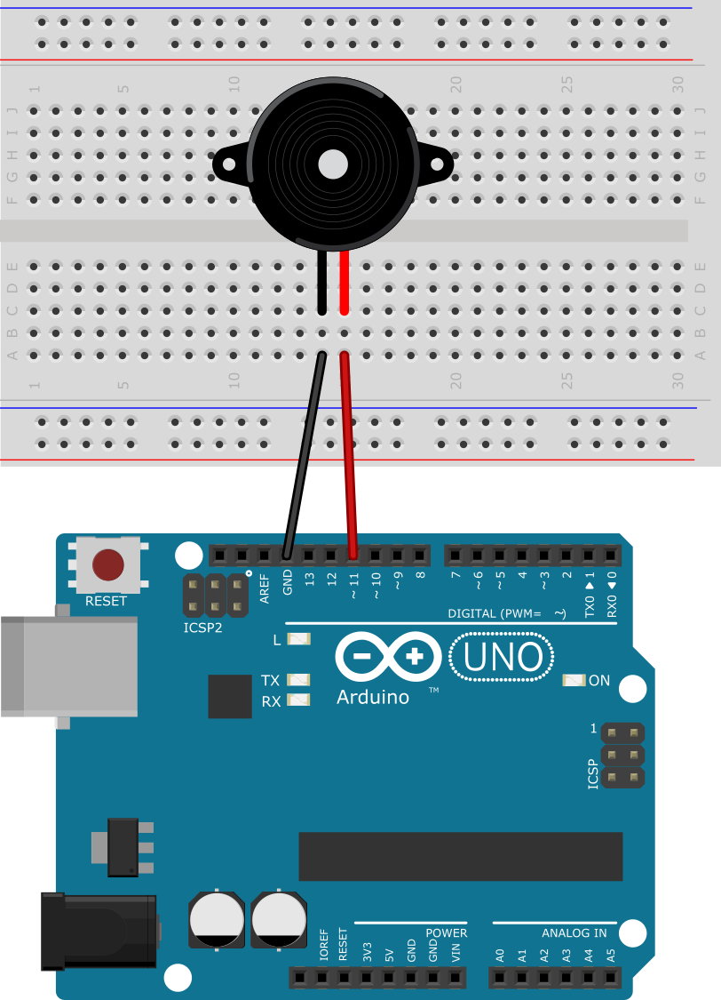
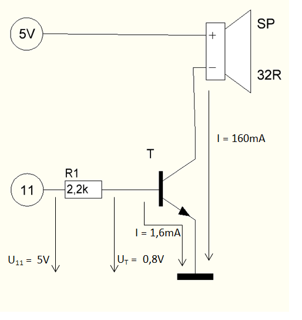
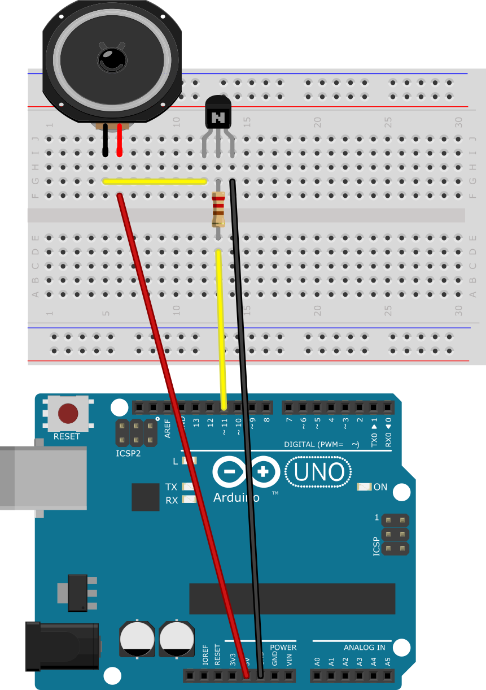

# 5. Töne, Unterprogramme, Transistor

## 5.1 Alle meine Entchen

Wie immer gibt es verschiedene Wege, alle meine Entchen zu implementieren. Eine Anfängerversion, in der die Befehle für
die Töne einfach nacheinander kommen.

[AlleMeineEntchen_beginner.ino]({GITHUB}/programme/ArduinoEinfuehrung/5.1_AlleMeineEntchen/AlleMeineEndchen_beginner/AlleMeineEntchen_beginner.ino ':include :type=code arduino :link :wrap :open')

Und eine Expertenversoin, in der mithilfe einer Schleife durch ein array iteriert wird und der jeweilige Ton in seiner
Länge gespielt wird.

[AlleMeineEntchen_expert.ino]({GITHUB}/programme/ArduinoEinfuehrung/5.1_AlleMeineEntchen/AlleMeineEndchen_expert/AlleMeineEntchen_expert.ino ':include :type=code arduino :link :wrap :open')

### Versuchsaufbau

## 5.2 Eigene Funktionen

Durch eigene Funktionen kann man sehr viele Zeilen an doppeltem Code sparen und gleichzeitig etwas an Struktur und
Ordnung in das Programm bringen.

[EigeneFunktionen.ino]({GITHUB}/programme/ArduinoEinfuehrung/5.2_EigeneFunktionen/EigeneFunktionen.ino ':include :type=code arduino :link :wrap')

## 5.3 Transistor vor dem Lautsprecher

Will man nun doch etwas mehr Soundqualität, so muss man zu einem richtigen Lautsprecher greifen. Da durch einen großen
Lautsprecher ein größerer Strom fließt, muss man ihn noch mit einem Transistor verstärken, wie in der nachfolgenden
Schaltung aufgezeichnet. Der Widerstand mit 2,2kΩ in der folgenden Schaltung wird verwendet, um den Strom, der am
Transistor anliegt zu begrenzen, so dass der Transistor nicht zu heiß wird.

### 5.3.1 Berechnung des Basiswiderstand (fortgeschritten)

1. Um den Widerstand zu berechnen berechnet man als erstes die Spannung, die am Widerstand abfallen muss.

$\LARGE U_{R}=5V-0,8V=4,2V$

2. Dann berechnet man die Stromstärke, die durch den Lautsprecher und den Transistor fließt.

$\LARGE I=\frac{U}{R}=\frac{5V}{32\Omega}=0,15625A$

3. Ein handelsüblicher NPN - Transistor hat einen Verstärkungsfaktor von ungefähr (B = 100).

$\LARGE I_{R}=\frac{0,15625A}{100}=0,001525A$

4. Als letztes müssen wir nun den richtigen Widerstand aus den zuvor berechneten Werten berechnen.

$\LARGE R_{1}=\frac{U_{R}}{I_{R}}=\frac{4,2V}{0,001525A}=2754\Omega$

5. Der nächstkleinere Wiedertand aus der E12 Reihe wäre 2,7kΩ aber wir nehmen den nächstkleineren 2,2kΩ Widerstand, so
   dass die Basis richtig durchgesteuert wird.

