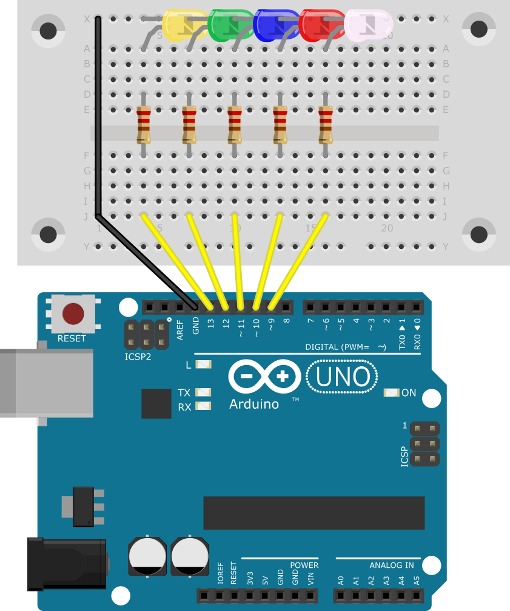

# 8 for - Schleife

## 8.1 Was machen die Parameter der for Schleife?

Das Programm wird 30mal `Hallo` und in die nächste Zeile den aktuellen Wert von `n` schreiben, der die Anzahl an bereits
passierten Durchläufen angibt. Wenn man im ersten Parameter der for – Schleife `n = 5` angibt, fängt die Schleife bei
`5` statt bei `0` an. Wenn man im zweiten Parameter `n < 50` verwendet wird die Schleife mit einem ersten Parameter von
`n = 0` statt nur 30mal 50mal durchlaufen. Und wenn man als dritten Parameter `n = n + 3` angibt, wird das Programm die
Variable `n` in Dreierschritten während des Durchlaufs hochzählen.

## 8.2 Was tut diese Schleife?

Dieses Programm wird einen Ton abspielen, der bei 100Hz anfängt, und sich in 3er Schritten alle 60ms bis zu 1000Hz
erhöht.

## 8.3 Yelp – Sirene

Um eine Yelp – Sirene, wie in diesem [Video](https://www.youtube.com/watch?v=m84m1A62KxQ) zu implementieren braucht man
zwei `for` - Schleifen, die den Ton abwechselnd höher und tiefer werden lassen

[YelpSirene.ino]({GITHUB}/programme/ArduinoEinfuehrung/8.3_YelpSirene/YelpSirene.ino ':include :type=code arduino :link :wrap :open')

## 8.4 Lauflicht

Dieses Programm nutzt eine `for` - Schleife, um im Setup Teil alle Pins zu initialisieren und eine, um im Loop Teil die
LEDs abwechselnd blinken zu lassen. Diesen Versuchsaufbau kann man dafür verwenden.

[Lauflicht.ino]({GITHUB}/programme/ArduinoEinfuehrung/8.4_Lauflicht/Lauflicht.ino ':include :type=code arduino :link :wrap :open')
