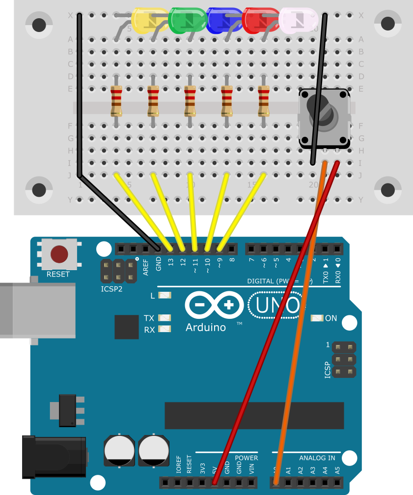
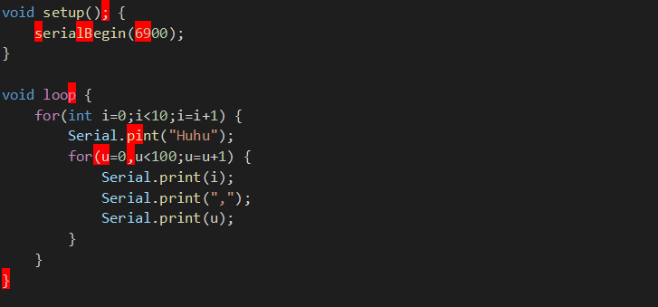

# 9. LEDs Dimmen und Farben

## 9.1 LED Dimmen

Um eine LED zu dimmen muss man statt `digitalWrite`, `analogWrite` nehmen. Dieses Programm dimmt die LED an Pin 11.

[Dimmen.ino]({GITHUB}/programme/ArduinoEinfuehrung/9.1_Dimmen/Dimmen.ino ':include :type=code arduino :link :wrap :open')

## 9.2 Dunkel Heller Programm

Dieses Programm lässt die LED langsam dunkler -> heller werden.

[DunklerHeller.ino]({GITHUB}/programme/ArduinoEinfuehrung/9.2_DunklerHeller/DunklerHeller.ino ':include :type=code arduino :link :wrap :open')

## 9.3 Halbe Helligkeit

Wenn man herausfinden will, welcher Wert die halbe Helligkeit ist, braucht man erst einmal einen Referenzwert. Dies kann
man mit einer zweiten LED in derselben Farbe, die auf 100% Helligkeit ist, lösen. Um nun die halbe Helligkeit
herauszufinden, kann man wie auch schon zuvor in einer einfachen Variante alle Werte mithilfe folgendem Programm
austesten.

[HerausfindenDurchAusprobieren.ino]({GITHUB}/programme/ArduinoEinfuehrung/9.3_HelligkeitHerausfinden/HerausfindenDurchAusprobieren/HerausfindenDurchAusprobieren.ino ':include :type=code arduino :link :wrap :open')

oder das Ganze mit einem verstellbaren Widerstand machen

[HerausfindenDurchPoti.ino]({GITHUB}/programme/ArduinoEinfuehrung/9.3_HelligkeitHerausfinden/HerausfindenDurchPoti/HerausfindenDurchPoti.ino ':include :type=code arduino :link :wrap :open')

?> Ich empfinde einen Wert zwischen 75 und 85 als halbe Helligkeit.

### Schaltung mit Poti



## 9.4 Flackernde Kerze

Dieses Programm lässt die LED flackern, indem es die LED in zufälligen Abständen zufällig hell/dunkel einschaltet.

[FlackerKerze.ino]({GITHUB}/programme/ArduinoEinfuehrung/9.4_FlackerndeKerze/FlackerKerze/FlackerKerze.ino ':include :type=code arduino :link :wrap :open')

### RGB LED - Mischfarben

```diff
Rot + grün -> Gelb
Rot + Blau -> Violett
Grün + Blau -> Cyan
```

### LED Aufbau


## 9.6 Fehlersuche

```arduino
void setup(); {
    serialBegin(6900);
}

void loop {
    for(int i=0;i<10;i=i+1) {
        Serial.pint("Huhu");
        for(u=0,u<100;u=u+1) {
            Serial.print(i);
            Serial.print(",");
            Serial.print(u);
        }
    }

```



[FehlerImProgramm_lösung.ino]({GITHUB}/programme/ArduinoEinfuehrung/9.6_FehlerImProgramm/FehlerImProgramm.ino ':include :type=code arduino :link :wrap')

Ich habe 9 syntaktische Fehler gefunden.

## 9.7 Alle möglichen Farben einer RGB LED

Das folgende Programm geht alle $16.777.216$ ($256^3$) Farben durch. Das wird sehr komisch aussehen, erfüllt aber die
Aufgabe, da es als Erstes den Rot-Wert auf $1$ setzt, dann den Grün-Wert auch auf $1$ und dann alle $255$ Blau-Werte
durch geht. Dann wird es den Rot-Wert auf $2$ erhöhen und wieder alle Blau-Werte durchgehen. Ein solcher Durchlauf
dauert dann $255^3ms$.

[AlleMoeglichenFarben.ino]({GITHUB}/programme/ArduinoEinfuehrung/9.7_AlleMoeglichenFarben/AlleMoeglichenFarben/AlleMoeglichenFarben.ino ':include :type=code arduino :link :wrap')

Wenn man aber alle Farben nacheinander gemischt durchgehen möchte, kann man folgenden Sketch verwenden.
[AmbientLight.ino]({GITHUB}/programme/ArduinoEinfuehrung/9.7_AlleMoeglichenFarben/AmbientLight/AmbientLight.ino ':include :type=code arduino :link :wrap')
