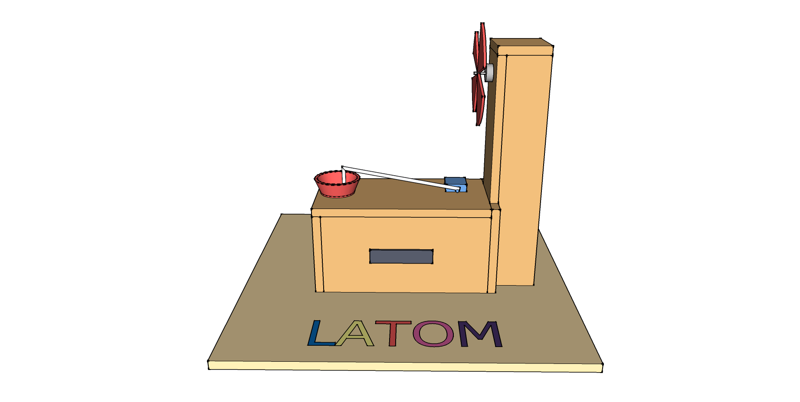
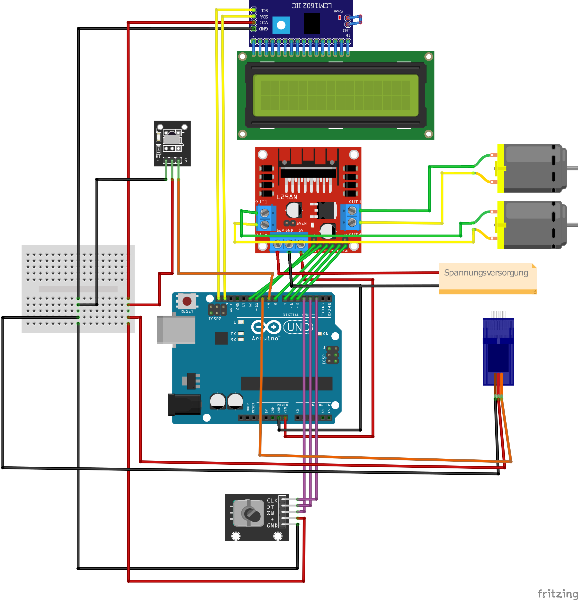

# Bubble Machine - LATOM

## 3D - Model

## Display menu

| Name              | Funktion                                                                         | Wertebereich (Best practise)   |
| ----------------- | -------------------------------------------------------------------------------- | ------------------------------ |
| `Start `          | Startet die Seifenblasenproduktion                                               |                                |
| `Load `           | Hebt den Arm zum befüllen des Behälters an                                       |                                |
| `About `          | Zeigt Informationen über die Maschiene an                                        |                                |
| `Servo - speed `  | Geschwindigkeit in der der Servo den Arm anhebt                                  | `[0;255]%` (`20`)              |
| `Servo - angle `  | Den Winkel, den der Servo sich dreht, wenn er den Arm hebt                       | `[0;170]deg` (`90`)            |
| `Motor - delay `  | Die Zeit, die gewartet wird, bis die Rotoren angehen, nachdem der Servo oben ist | `[0;2.147.483.647]ms` (`1000`) |
| `Motor1 - speed ` | Die Geschwindigkeit des Motors 1                                                 | `[0;255]%` (`200`)             |
| `Motor2 - speed ` | Die Geschwindigkeit des Motors 2                                                 | `[0;255]%` (`100`)             |
| `Motor - delay `  | Die Zeit, die der Motor läuft                                                    | `[0;2.147.483.647]ms` (`8000`) |
| `Servo - delay `  | Die Zeit nachdem die Motoren aus sind, bis der Servo wieder runter fährt         | `[0;2.147.483.647]ms` (`1000`) |
| `Servo - speed `  | Die Geschwindigkeit, in der der servo den Arm wieder senkt                       | `[0;255]%` (`40`)              |

## Schaltplan

